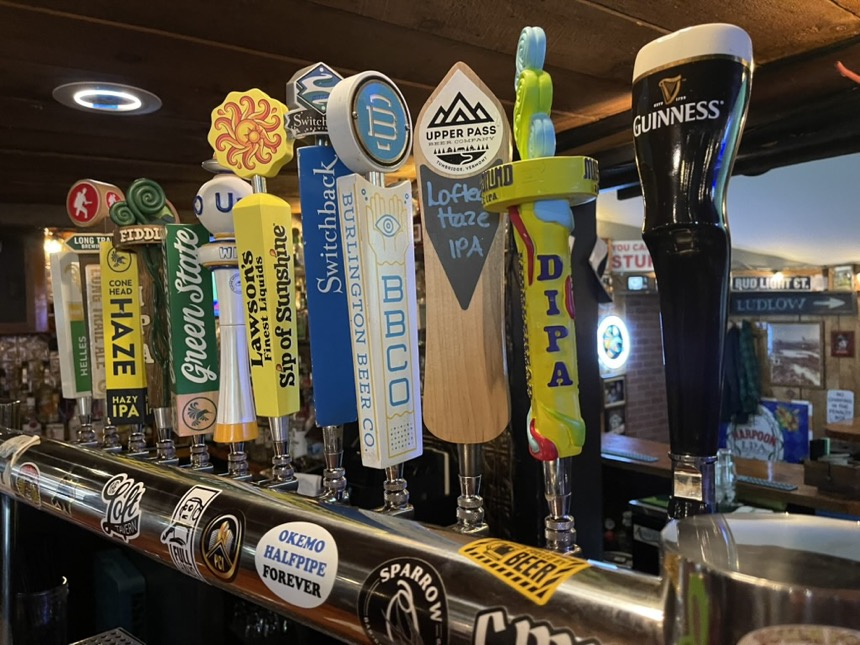

# The Loft Tavern — Website

## Folder structure

```
loft-site/
├── index.html        ← Home page (4 panels)
├── food_menu.html    ← Food menu (iMenuPro embed)
├── drink_menu.html   ← Drink menu (iMenuPro embed)
├── hours.html        ← Hours, takeout, seating, map
├── style.css         ← ALL styles — edit here, affects every page
├── images/           ← Put your photos here
│   ├── bar.jpg
│   ├── food.jpg
│   ├── outside.jpg
│   └── team.jpg
└── README.md         ← This file
```

---

## Common edits

### Update hours
- Edit in **two places**: the `hours-grid` section in `hours.html` AND the footer block
- The footer is copied identically into all four HTML files, so update it in each

### Change address / phone
- Search for `555-1234` across all files (VS Code: Cmd+Shift+F) and replace

### Add your Google Maps embed
1. Go to maps.google.com → search The Loft Tavern
2. Click Share → Embed a map → copy the `src="..."` URL (just the URL, not the whole iframe)
3. In VS Code: Cmd+Shift+F, search for the placeholder map src, replace all instances

### Add your Square gift card link
- Cmd+Shift+F → search `YOURCODE` → replace with your actual Square link

### Add real photos
1. Drop your JPEGs into the `images/` folder
2. In `index.html`, find each `<div class="panel-img-placeholder">` and replace with:
   ```html
   
   ```
3. Recommended sizes: 860×500px, JPEG, under 120KB each (use squoosh.app to compress)

### Paste iMenuPro embed
1. Log into iMenuPro → your menu → Share/Embed → copy snippet
2. In `food_menu.html` (or `drink_menu.html`): delete the `<div class="embed-placeholder">` block
3. Paste your snippet inside `<div class="embed-wrap">`

### Change open/closed status (hours.html)
- Find `<span class="status-pill open">` and change `open` to `closed`
- Update the label text inside it

---

## VS Code tips

- **Find & replace across all files**: Cmd+Shift+F (Mac) or Ctrl+Shift+F (Windows)
- **Live preview**: install the "Live Server" extension → right-click index.html → Open with Live Server
- **Format HTML**: Option+Shift+F (Mac) or Alt+Shift+F (Windows)

---

## Publishing to InfinityFree via FTP

### One-time setup (FileZilla — free)
1. Download FileZilla: https://filezilla-project.org
2. Open FileZilla → File → Site Manager → New Site
3. Fill in your InfinityFree FTP credentials:
   - Host: (from InfinityFree control panel → FTP Accounts)
   - Protocol: FTP
   - Encryption: Use explicit FTP over TLS if available
   - Logon Type: Normal
   - User / Password: from InfinityFree
4. Click Connect

### Publishing a change
1. In FileZilla, navigate to `/htdocs/` on the right (server side)
2. On the left (your computer), open your `loft-site/` folder
3. Drag only the files you changed to the right panel
   - Changed hours? Upload just `hours.html`
   - Changed styles? Upload just `style.css` (affects all pages)
   - Added a photo? Upload the new file in `images/`
4. Done — changes are live immediately

### What to upload the first time
Upload everything: all `.html` files, `style.css`, and the entire `images/` folder.
After that, only upload what changed.

---

## Image compression (free, browser-based)
https://squoosh.app — drag your photo in, set format to MozJPEG, quality ~75, resize to 860px wide. Keeps file size under 100KB.
